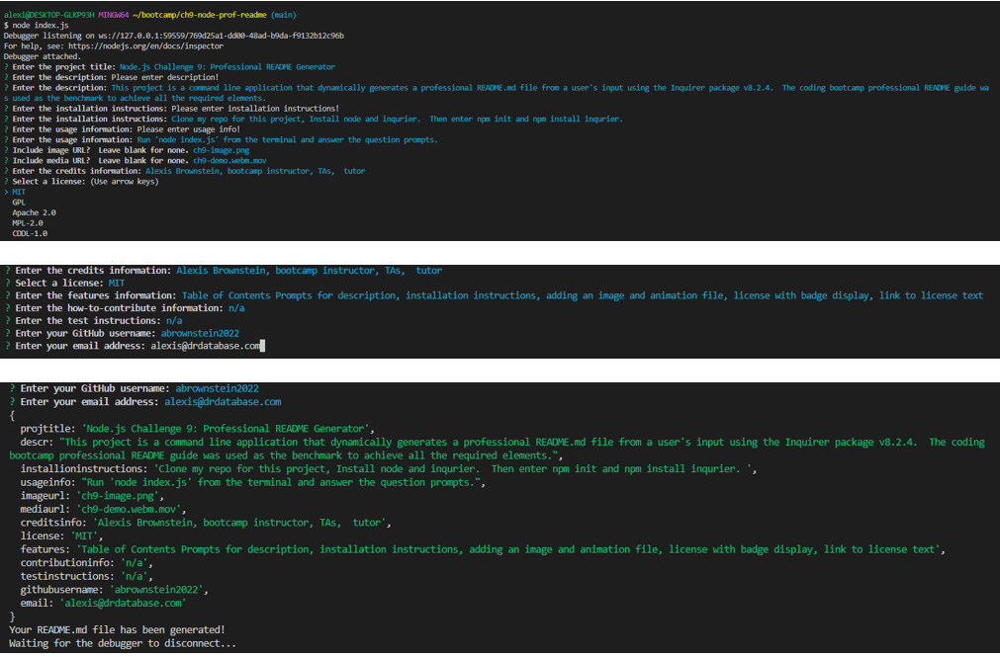

# Professional README Generator Using Node.js


## Description

```md
The project is a command line application that dynamically generates a professional README.md file from a user's input using the Inquirer package v8.2.4.  The coding bootcamp README guide was used as the benchmark to achieve all the required elements. 
```

## Table of Contents

- [Description](#description)
- [Installation](#installation)
- [Usage](#usage)
- [Credits](#credits)
- [License](#license)
- [Features](#features)
- [How-to-Contribute](#how-to-contribute)
- [Tests](#test-instructions)
- [Questions](#questions)

## Installation

```md
Clone my repo for this project, install node and inquirer.  Then enter npm init and npm install inquirer.
```

## Usage

```md
Run node index.js from the terminal and answer the question prompts.
```




## Credits

```md
Alexis Brownstein, bootcamp instructor, TAs and Tutor 
```

## License

 ```md
 GPL 
```

Link to license text:
https://opensource.org/licenses/gpl-license


## Features

```md
The main features in this project are:
table of contents prompts for description, usage, installati+on instructions, adding an image and animation file, license with badge display, link to license text
```

## How-to-Contribute

```md
n/a
```

## Test Instructions

```md
n/a
```

## Questions

```md
Feel free to contact me with any questions.

My email is: alexis@drdatabase.com.
```

My GitHub Profile link:
  
  https://github.com/abrownstein2022
 
